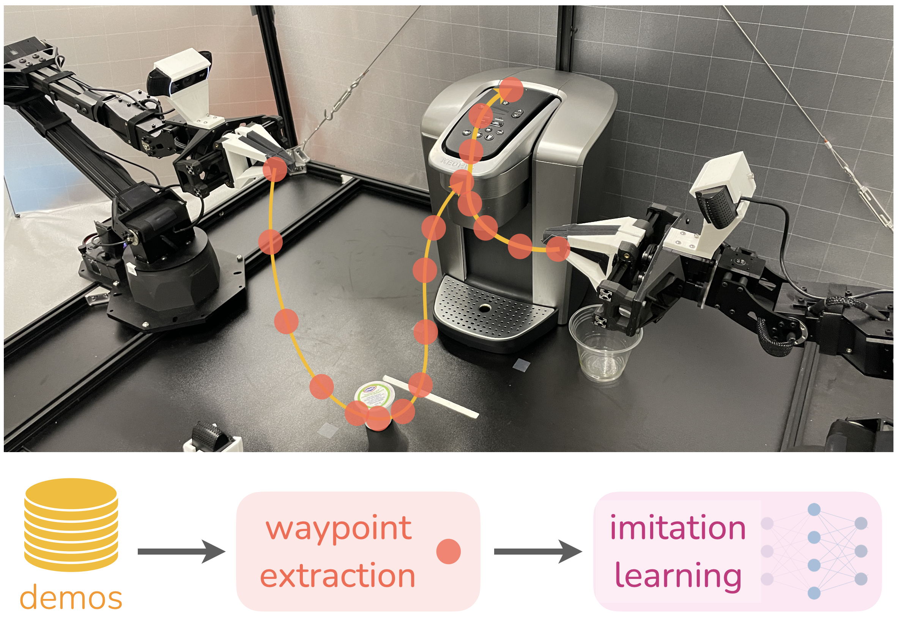

# Automatic Waypoint Extraction (AWE)
[[Project website](https://lucys0.github.io/awe/)] [[Paper](https://arxiv.org/abs/2307.14326)]



This repo contains the implementation of Automatic Waypoint Extraction (AWE): a plug-and-play module for selecting waypoints from demonstrations for performant behavioral cloning.  This repo also includes instantiations of combining AWE with two state-of-the-art imitation learning methods, [Diffusion Policy](https://arxiv.org/abs/2303.04137) and [Action Chunking with Transformers (ACT)](https://arxiv.org/abs/2304.13705), and the respective benchmarking environments, [RoboMimic](https://robomimic.github.io/) and [Bimanual Simulation Suite](https://sites.google.com/view/https://tonyzhaozh.github.io/aloha/).

Given a set of demonstrations and an error threshold, extracting waypoints is as simple as:
```bash
pip install waypoint-extraction
import waypoint_extraction as awe
waypoints = awe.extract_waypoints(states, err_threshold)
```

If you encountered any issue, feel free to contact lucyshi (at) stanford (dot) edu


## Installation
1. Clone this repository
```bash
git clone git@github.com:lucys0/awe.git
cd awe
```

2. Create a virtual environment
```bash 
conda create -n awe_venv python=3.9
conda activate awe_venv
```

3. Install MuJoCo 2.1
* Download the MuJoCo version 2.1 binaries for [Linux](https://mujoco.org/download/mujoco210-linux-x86_64.tar.gz) or [OSX](https://mujoco.org/download/mujoco210-macos-x86_64.tar.gz).
* Extract the downloaded `mujoco210` directory into `~/.mujoco/mujoco210`.

4. Install packages
```bash
pip install -e .
```

## RoboMimic
### Set up the environment
```bash
# install robomimic
pip install -e robomimic/

# install robosuite
pip install -e robosuite/
```

### Download data
```bash
# download unprocessed data from the robomimic benchmark
python robomimic/robomimic/scripts/download_datasets.py --tasks lift can square  

# download processed image data from diffusion policy (faster)
mkdir data && cd data
wget https://diffusion-policy.cs.columbia.edu/data/training/robomimic_image.zip
unzip robomimic_image.zip && rm -f robomimic_image.zip && cd ..
```

### Usage
Please replace `[TASK]` with your desired task to train. `[TASK]={lift, can, square}`
* Convert delta actions to absolute actions
```bash
python utils/robomimic_convert_action.py --dataset=robomimic/datasets/[TASK]/ph/low_dim.hdf5
```

* Save waypoints
```bash
python utils/robomimic_save_waypoints.py --dataset=robomimic/datasets/[TASK]/ph/low_dim.hdf5 --err_threshold=0.005
```

* Replay waypoints (save 3 videos and 3D visualizations by default)
```bash
mkdir video
python example/robomimic_waypoint_replay.py --dataset=robomimic/datasets/[TASK]/ph/low_dim.hdf5 \
    --record_video --video_path video/[TASK]_waypoint.mp4 --task=[TASK] \
    --plot_3d --auto_waypoint --err_threshold=0.005
```

## AWE + Diffusion Policy

### Install Diffusion Policy
```bash
conda env update -f diffusion_policy/conda_environment.yaml
```
If the installation is too slow, consider using [Mambaforge](https://github.com/conda-forge/miniforge#mambaforge) instead of the standard anaconda distribution, as recommended by the [Diffusion Policy](https://github.com/columbia-ai-robotics/diffusion_policy#%EF%B8%8F-installation) authors. That is:

```bash
mamba env create -f diffusion_policy/conda_environment.yaml
```

### Train policy
```bash
python diffusion_policy/train.py --config-dir=config --config-name=waypoint_image_[TASK]_ph_diffusion_policy_transformer.yaml hydra.run.dir='data/outputs/${now:%Y.%m.%d}/${now:%H.%M.%S}_${name}_${task_name}'
```

## Bimanual Simulation Suite
### Set up the environment
```bash
conda env update -f act/conda_env.yaml
```

### Download data
Please download scripted/human demo for simulated environments from [here](https://drive.google.com/drive/folders/1gPR03v05S1xiInoVJn7G7VJ9pDCnxq9O) and save them in `data/act/`.

If you need real robot data, please contact Lucy Shi: lucyshi (at) stanford (dot) edu


### Usage
Please replace `[TASK]` with your desired task to train. `[TASK]={sim_transfer_cube_scripted, sim_insertion_scripted, sim_transfer_cube_human, sim_insertion_human}`

* Visualize waypoints
```bash
python example/act_waypoint.py --dataset=data/act/[TASK] --err_threshold=0.01 --plot_3d --end_idx=0 
```

* Save waypoints
```bash
python example/act_waypoint.py --dataset=data/act/[TASK] --err_threshold=0.01 --save_waypoints 
```

## AWE + ACT
### Train policy
```bash
python act/imitate_episodes.py \
    --task_name [TASK] \
    --ckpt_dir data/outputs/act_ckpt/[TASK]_waypoint \
    --policy_class ACT --kl_weight 10 --chunk_size 50 --hidden_dim 512 --batch_size 8 --dim_feedforward 3200 \
    --num_epochs 8000  --lr 1e-5 \
    --seed 0 --temporal_agg --use_waypoint
```
For human datasets, set `--kl_weight=80`, as suggested by the ACT authors. To evaluate the policy, run the same command with `--eval`. 


## Citation

If you find our code useful for your research, please cite:
```
@inproceedings{shi2023waypointbased,
  title     = {Waypoint-Based Imitation Learning for Robotic Manipulation},
  author    = {Lucy Xiaoyang Shi and Archit Sharma and Tony Z. Zhao and Chelsea Finn},
  year      = {2023},
  booktitle = {Conference on Robot Learning}
}
```
