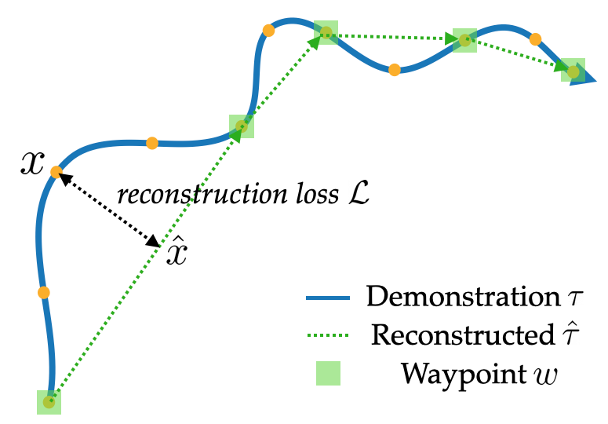
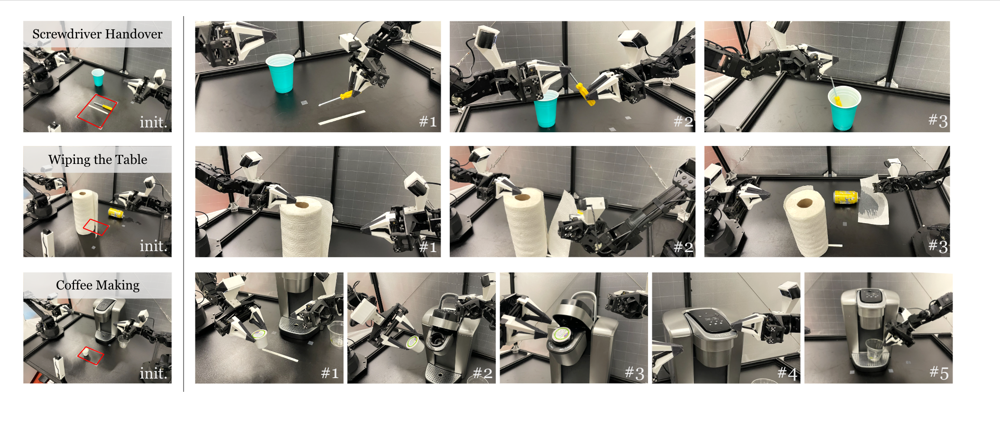
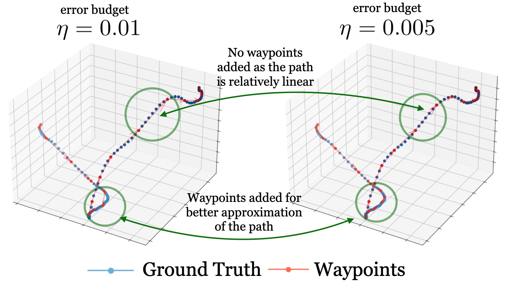

----


## Demo

<table style="width:100%; margin: auto; max-width: 1200px; table-layout: fixed;">
<tbody>
  <tr style="border-bottom: none;">
    <td style="text-align: center">
        <video id="round" height="auto" width="95%" controls autoplay loop>
            <source src="video/new-coffee.mp4" type="video/mp4">
        </video>
    </td>
  </tr>
</tbody>
</table>

----


## Motivation

Behavioral cloning (BC) has achieved impressive robotic results, from self-driving cars to complex manipulation. However, BC suffers from compounding errors, especially for long-horizon tasks. Waypoints, or “key” states, can alleviate this problem by reducing the effective horizon of decision-making, but labeling these waypoints usually requires extra human supervision.


----


## Automatic Waypoint Extraction (AWE)

We aim to develop an automated method to select waypoints for any given task. If parts of a robotic arm's trajectory are approximately linear, they can be represented simply by their endpoints. A low-level controller can reliably move between endpoints without explicitly learning the intermediate actions. Extending this concept to more complex trajectories allows us to transform the BC problem from predicting next actions to predicting next waypoints.

<!--  -->

<div class="w3-row-padding">
    
    <figcaption class="imgcaption">We select waypoints by using dynamic programming to recursively choose the shortest subsequence of states that approximates the trajectory within an acceptable reconstruction error budget.</figcaption>
</div>

We propose AWE, a preprocessing module that breaks expert demonstrations into waypoints. AWE only uses the robot's proprioception, requiring no additional input or assumptions about the external environment. When plugged into state-of-the-art imitation learning methods, AWE consistently improves performance in both simulated and real-robot tasks.


----


## Real-World Bimanual Tasks

For real-robot evaluations, we use [ALOHA](https://tonyzhaozh.github.io/aloha/), a low-cost open-source bimanual hardware setup. We consider 3 challenging real-world bimanual tasks: (top) picking up a screw driver, handing it over to the other arm, and placing it in a cup, (middle) tearing off a segment of paper towel and putting it on a spill, and (bottom) putting a coffee pod into a coffee machine, closing the coffee machine, and placing a cup underneath the dispenser. The initial object positions are initialized within the red rectangle.

<div class="w3-row-padding">
    
</div>

The three tasks emphasize precision and coordination, and involve deformable or transparent objects that can be hard to perceive or simulate.

----
## Quantitative Results

AWE achieves substantial success on each task. Plugging our automatic waypoint selection method into [ACT](https://arxiv.org/abs/2304.13705), a state-of-the-art imitation learning method, consistently improves the performance of ACT on all tasks. On the most difficult coffee making task, AWE improves success by 28%.

 for real world tasks")

----


## Coffee Making

Placing the coffee pod into the machine requires high precision. It is easy for the gripper or coffee pod to collide with the machine due to the small clearance.

<div class="slideshow-container" id="coffeeGroup">
  <div class="mySlides fade">
    <figcaption class="imgcaption">Success</figcaption>
    <video id="coffee_success" width="95%" controls autoplay loop muted>
      <source src="video/coffee_success_2.mp4" type="video/mp4">
    </video>
  </div>
  <div class="mySlides fade">
    <figcaption class="imgcaption">Failure</figcaption>
    <video id="coffee_failure" width="95%" controls autoplay loop muted>
      <source src="video/coffee_failure_2.mp4" type="video/mp4">
    </video>
  </div>
  <a class="prev" onclick="plusSlides(-1, 'coffeeGroup')">&#10094;</a>
  <a class="next" onclick="plusSlides(1, 'coffeeGroup')">&#10095;</a>
</div>

<br>

We observe that the most common failure case for ACT is inaccurate action prediction, which results from compounding errors.
For example, the robot may make a wrong prediction at the beginning and grasp the coffee pod at an inconvenient position. The subsequent predictions become increasingly incorrect, and thus the robot fails to insert the coffee pod into the machine.
On the other hand, AWE can more accurately grasp the coffee pod due to a smaller decision horizon, resulting in more successful insertions into the coffee machine. Leveraging the low-level controller to execute linear motions instead of relying on accurate policy predictions can reduce the errors compounded over time.

----


## Wiping the Table
Grasping the paper towel requires accurate perception of the deformable material, which also has low-contrast against itself. The gripper needs to move accurately so as to only grasp the opening but not collide with the roll and push it away.


<div class="slideshow-container" id="towelGroup">
  <div class="mySlides fade">
    <figcaption class="imgcaption">Success</figcaption>
    <video id="towel_success" width="95%" controls autoplay loop muted>
      <source src="video/towel_success.mp4" type="video/mp4">
    </video>
  </div>
  <div class="mySlides fade">
    <figcaption class="imgcaption">Failure</figcaption>
    <video id="towel_failure" width="95%" controls autoplay loop muted>
      <source src="video/towel_failure.mp4" type="video/mp4">
    </video>
  </div>
  <a class="prev" onclick="plusSlides(-1, 'towelGroup')">&#10094;</a>
  <a class="next" onclick="plusSlides(1, 'towelGroup')">&#10095;</a>
</div>

<br>

----


## Screwdriver Handover

The screwdriver handover task emphasizes the coordination between two arms: the left arm needs to properly react to grasping errors from the previous stage.

<div class="slideshow-container" id="screwdriverGroup">
  <div class="mySlides fade">
    <figcaption class="imgcaption">Success</figcaption>
    <video id="screwdriver_success" width="95%" controls autoplay loop muted>
      <source src="video/screwdriver_success_2.mp4" type="video/mp4">
    </video>
  </div>
  <div class="mySlides fade">
    <figcaption class="imgcaption">Failure</figcaption>
    <video id="screwdriver_failure" width="95%" controls autoplay loop muted>
      <source src="video/screwdriver_failure_2.mp4" type="video/mp4">
    </video>
  </div>
  <a class="prev" onclick="plusSlides(-1, 'screwdriverGroup')">&#10094;</a>
  <a class="next" onclick="plusSlides(1, 'screwdriverGroup')">&#10095;</a>
</div>

<br>


----

## Qualitative results

<div class="w3-row-padding">
    
    <figcaption class="imgcaption">Progression of waypoints selected by AWE as the error budget reduces. Fewer waypoints are added if the segment is better approximated by linear interpolation.</figcaption>
</div>

<script>
var slideIndex = {}; // A map to hold current slide index for each group

function plusSlides(n, groupName) {
  showSlides(slideIndex[groupName] += n, groupName);
}

function showSlides(n, groupName) {
  var i;
  var slides = document.getElementById(groupName).getElementsByClassName("mySlides");
  
  // Initialize slide index for this group if not already done
  if (!slideIndex.hasOwnProperty(groupName)) {
    slideIndex[groupName] = 1;
  }

  if (n > slides.length) {slideIndex[groupName] = 1}
  if (n < 1) {slideIndex[groupName] = slides.length}
  for (i = 0; i < slides.length; i++) {
      slides[i].style.display = "none";  
  }
  slides[slideIndex[groupName]-1].style.display = "block";  
}

// Show the first slide for each group
showSlides(1, 'coffeeGroup');
showSlides(1, 'towelGroup');
showSlides(1, 'screwdriverGroup');

</script>

----

## Try it out!

Given a set of demonstrations and an error threshold, extracting waypoints is as simple as:
```bash
pip install waypoint-extraction
import waypoint_extraction as awe
waypoints = awe.extract_waypoints(states, err_threshold)
```

----


## Citation
```
@inproceedings{shi2023waypointbased,
  title     = {Waypoint-Based Imitation Learning for Robotic Manipulation},
  author    = {Lucy Xiaoyang Shi and Archit Sharma and Tony Z. Zhao and Chelsea Finn},
  year      = {2023},
  booktitle = {Conference on Robot Learning}
}
```
<br>
